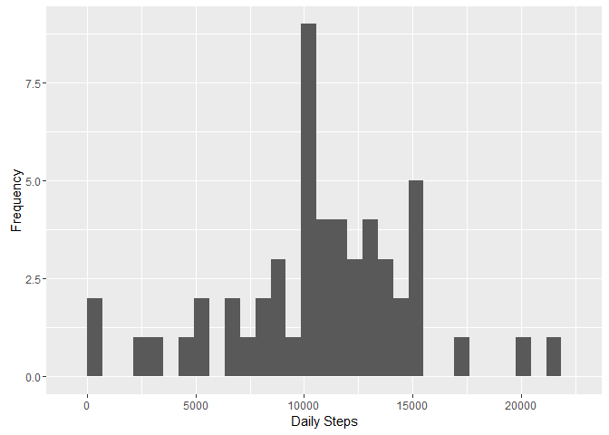
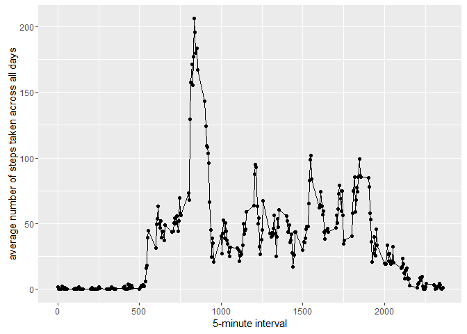
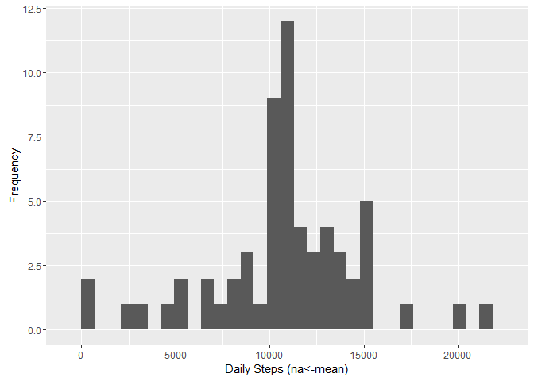
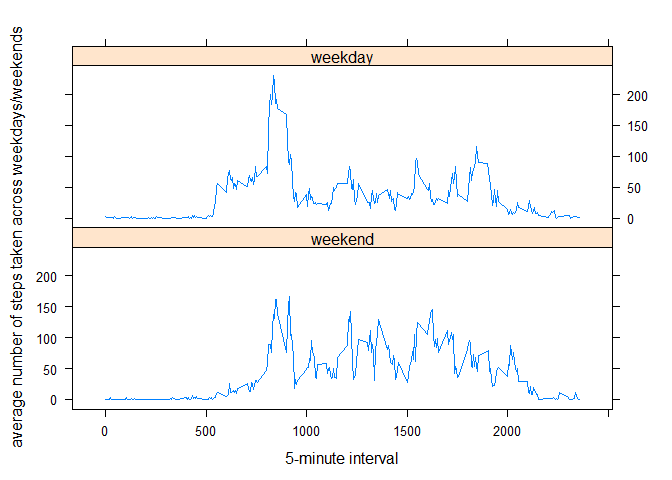

# Reproducible Research: Peer Assessment 1


## Loading and preprocessing the data

```r
library(dplyr)
library(ggplot2)
library(lattice)
data <- read.csv(file="activity.csv")
```
## What is mean total number of steps taken per day?

1. Histogram of the total number of steps taken each day

```r
data_bydate <- data %>% 
  filter( !is.na(steps) ) %>% 
  group_by( date ) %>% 
  summarize( daily.steps = sum(steps) )

qplot( daily.steps, data=data_bydate, xlab="Daily Steps", ylab="Frequency" )
```



2. mean and median total number of steps taken per day

```r
mean(data_bydate$daily.steps)
```

```
## [1] 10766.19
```

```r
median(data_bydate$daily.steps)
```

```
## [1] 10765
```

## What is the average daily activity pattern?


```r
data_byinterval <- data %>% 
  filter( !is.na(steps) ) %>% 
  group_by( interval ) %>% 
  summarize( avg.steps = mean(steps) )
qplot( interval, avg.steps, data=data_byinterval, xlab="5-minute interval", ylab="average number of steps taken across all days") + geom_line()
```



The 5-minute interval with maximum number of steps is 835

## Imputing missing values


1. Total number of missing values in the dataset

```r
data %>% 
  filter( is.na(steps) ) %>% 
  summarize( total.na.count = n() )
```

```
##   total.na.count
## 1           2304
```


2. Filling in missing values: use the mean for that 5-minute interval
3. Create a new dataset that is equal to the original dataset but with the missing data filled in.

```r
data_nareplaced <- 
  merge(x=data, y=data_byinterval, by="interval") %>%
  mutate( steps = ifelse(is.na(steps), avg.steps, steps) ) %>%
  select( steps, date, interval)
```

4. Make new histogram and calculate new mean and median. Different? What is the impact of imputing missing data on the estimates of the total daily number of steps?


```r
data_nareplaced_bydate <- data_nareplaced %>% 
  group_by( date ) %>% 
  summarize( daily.steps = sum(steps) )

qplot( daily.steps, data=data_nareplaced_bydate, xlab="Daily Steps (na<-mean)", ylab="Frequency" )
```



```r
mean(data_nareplaced_bydate$daily.steps)
```

```
## [1] 10766.19
```

```r
median(data_nareplaced_bydate$daily.steps)
```

```
## [1] 10766.19
```

Note that the new mean did not change, and the new median = mean.

## Are there differences in activity patterns between weekdays and weekends?


```r
wds <- c('Monday', 'Tuesday', 'Wednesday', 'Thursday', 'Friday')
data_nareplaced$wk <- factor( 
  (weekdays(as.Date(data_nareplaced$date)) %in% wds), 
  levels=c(FALSE, TRUE), 
  labels=c('weekend', 'weekday')
)

data_byinterval_bywk <- data_nareplaced %>% 
  group_by( interval, wk ) %>% 
  summarize( avg.steps = mean(steps) )

xyplot( avg.steps~interval | wk, data=data_byinterval_bywk, xlab="5-minute interval", ylab="average number of steps taken across weekdays/weekends", type='l', layout=(c(1,2)))
```


